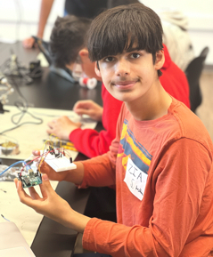
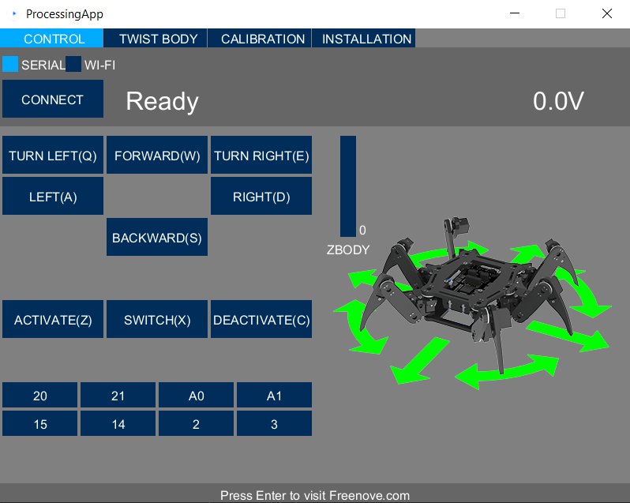
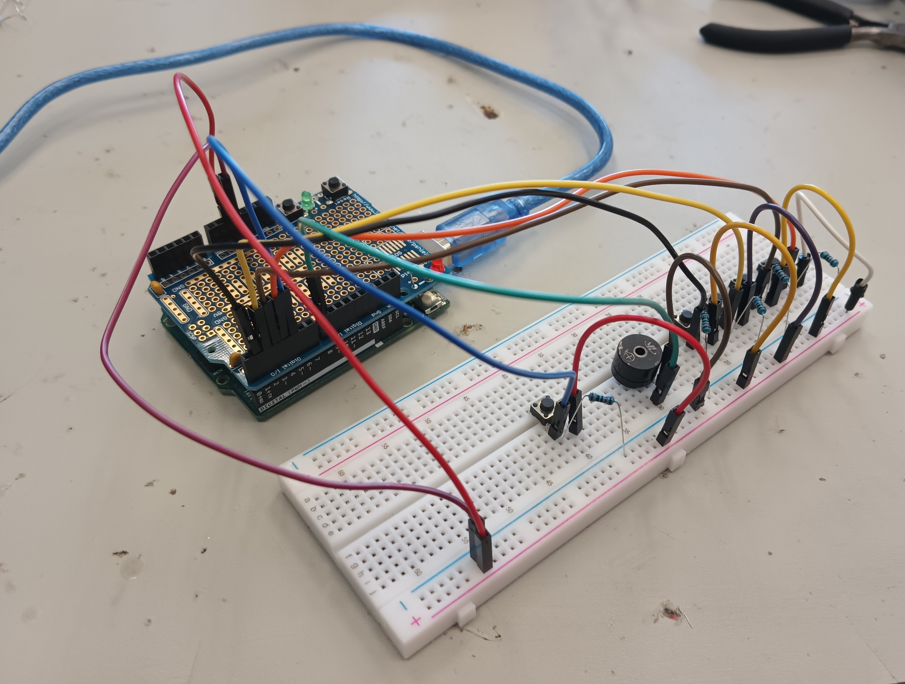

# Hexapod
Replace this text with a brief description (2-3 sentences) of your project. This description should draw the reader in and make them interested in what you've built. You can include what the biggest challenges, takeaways, and triumphs from completing the project were. As you complete your portfolio, remember your audience is less familiar than you are with all that your project entails!

| **Engineer** | **School** | **Area of Interest** | **Grade** |
|:--:|:--:|:--:|:--:|
| Zia S. | Archbishop Mitty Highschool | Computer Engineering | Rising Freshman |

**Replace the BlueStamp logo below with an image of yourself and your completed project. Follow the guide [here](https://tomcam.github.io/least-github-pages/adding-images-github-pages-site.html) if you need help.**


  
# Final Milestone
For your final milestone, explain the outcome of your project. Key details to include are:
- What you've accomplished since your previous milestone
- What your biggest challenges and triumphs were at BSE
- A summary of key topics you learned about
- What you hope to learn in the future after everything you've learned at BSE

**Don't forget to replace the text below with the embedding for your milestone video. Go to Youtube, click Share -> Embed, and copy and paste the code to replace what's below.**

<iframe width="560" height="315" src="https://www.youtube.com/embed/F7M7imOVGug" title="YouTube video player" frameborder="0" allow="accelerometer; autoplay; clipboard-write; encrypted-media; gyroscope; picture-in-picture; web-share" allowfullscreen></iframe>

# Second Milestone
For your second milestone, explain what you've worked on since your previous milestone. You can highlight:
- Technical details of what you've accomplished and how they contribute to the final goal
- What has been surprising about the project so far
- Previous challenges you faced that you overcame
- What needs to be completed before your final milestone 

**Don't forget to replace the text below with the embedding for your milestone video. Go to Youtube, click Share -> Embed, and copy and paste the code to replace what's below.**

<iframe width="560" height="315" src="https://www.youtube.com/embed/y3VAmNlER5Y" title="YouTube video player" frameborder="0" allow="accelerometer; autoplay; clipboard-write; encrypted-media; gyroscope; picture-in-picture; web-share" allowfullscreen></iframe>

# First Milestone

<h2>Materials</h2>
| **Part** | **Note** | **Price** | **Link** |
|:--:|:--:|:--:|:--:|
| FREENOVE Hexapod Robot Kit with Remote | Has all of the necessary pieces to build the Hexapod, including the leg pieces, servos, and control board | $129.95 | <a href="https://www.amazon.com/Freenove-Raspberry-Crawling-Detailed-Tutorial/dp/B07FLVZ2DN?th=1"> Link </a> |

| **Part** | **Note** | **Price** | **Link** |
|:--:|:--:|:--:|:--:|
| Item Name | What the item is used for | $Price | <a href="https://www.amazon.com/Arduino-A000066-ARDUINO-UNO-R3/dp/B008GRTSV6/"> Link </a> |
|:--:|:--:|:--:|:--:|


My first milestone was to assemble the Hexapod and calibrate the legs to their correct default positions. Before beginning assembly, I downloaded the Processing IDE which was required to run the software that would control the functions of the Hexapod, including walking and turning. The first day of the building was a bust as I screwed the servo stands (what the servos will be attached to) on the wrong side of the main body of the Hexapod and unfortunately had to unscrew everything which took up the rest of the day. On the second day, I screwed the servo stands on the main body correctly and moved on to screwing servo stands to the various pieces of each leg. I then assembled the bases of each leg which included two servos, one to be attached to the main body and another to the leg. Then came the most frustrating part of assembly: attaching the servos. I first had to power the control board using a non-lithium battery and then connect each servo to the board so that the servos would rotate to their default position. I also had to attach each servo to each servo stand at a certain angle which took up a lot of time and went into the third day. On the third day, the control board's battery cable fritzed and I had to recalibrate the servos again because the new board had a different default setting for the servo's rotation. After I attached the servos and built all six legs, I used the Processing software for the Hexapod to check for any deviations in the leg angles and fix them. Before I could do the final calibration, I had to download the following Arduino libraries: FlexiTimer.zip, FNHR.zip, and RF24.zip. These libraries are necessary for using the default functions of the Hexapod and programming it. Using the FNHR library, I uploaded the default Hexapod sketch (which allows Processing software to control Hexapod) to the control board. I was able to control the Hexapod through the software, using it for the final step of the assembly: calibrating the legs into their correct positions using a paper guide and a calibration function that allowed me to move each leg to their coressponding position. I did this for all six legs; with assembly complete, I could move the Hexapod forward, backward, sideways, and turn around. The next step is completing my second milestone: adding an ultrasound sensor to the Hexapod that allows it to move around in its environment. 




<h2>Robot.ino</h2>
  
```c++
/*
* Sketch     Default function sketch for robot
* Platform   Freenove Hexapod Robot (Compatible with Arduino/Genuino Mega 2560)
* Brief      This sketch is used to show default function of Freenove Hexapod Robot.
*            You can control the robot by remote control, Android device or computer.
*            Changing the code will make the default function not working properly.
* Author     Ethan Pan @ Freenove (support@freenove.com)
* Date       2020/04/24
* Copyright  Copyright © Freenove (http://www.freenove.com)
* License    Creative Commons Attribution ShareAlike 3.0
*            (http://creativecommons.org/licenses/by-sa/3.0/legalcode)
* -----------------------------------------------------------------------------------------------*/

#ifndef ARDUINO_AVR_MEGA2560
#error Wrong board. Please choose "Arduino/Genuino Mega or Mega 2560"
#endif

// Include FNHR (Freenove Hexapod Robot) library
#include <FNHR.h>

FNHR robot;

void setup() {
  // Start Freenove Hexapod Robot with default function
  robot.Start(true);
}

void loop() {
  // Update Freenove Hexapod Robot
  robot.Update();
}
```

**Don't forget to replace the text below with the embedding for your milestone video. Go to Youtube, click Share -> Embed, and copy and paste the code to replace what's below.**

<iframe width="560" height="315" src="https://www.youtube.com/embed/CaCazFBhYKs" title="YouTube video player" frameborder="0" allow="accelerometer; autoplay; clipboard-write; encrypted-media; gyroscope; picture-in-picture; web-share" allowfullscreen></iframe>

# Schematics 
Here's where you'll put images of your schematics. [Tinkercad](https://www.tinkercad.com/blog/official-guide-to-tinkercad-circuits) and [Fritzing](https://fritzing.org/learning/) are both great resoruces to create professional schematic diagrams, though BSE recommends Tinkercad becuase it can be done easily and for free in the browser. 


# Bill of Materials
Here's where you'll list the parts in your project. To add more rows, just copy and paste the example rows below.
Don't forget to place the link of where to buy each component inside the quotation marks in the corresponding row after href =. Follow the guide [here]([url](https://www.markdownguide.org/extended-syntax/)) to learn how to customize this to your project needs. 

| **Part** | **Note** | **Price** | **Link** |
|:--:|:--:|:--:|:--:|
| Item Name | What the item is used for | $Price | <a href="https://www.amazon.com/Arduino-A000066-ARDUINO-UNO-R3/dp/B008GRTSV6/"> Link </a> |
|:--:|:--:|:--:|:--:|
| Item Name | What the item is used for | $Price | <a href="https://www.amazon.com/Arduino-A000066-ARDUINO-UNO-R3/dp/B008GRTSV6/"> Link </a> |
|:--:|:--:|:--:|:--:|
| Item Name | What the item is used for | $Price | <a href="https://www.amazon.com/Arduino-A000066-ARDUINO-UNO-R3/dp/B008GRTSV6/"> Link </a> |
|:--:|:--:|:--:|:--:|

# Starter Project

My Starter Project is the Custom Arduino Project, in which I used a Piezo buzzer to play 4 different sounds by pressing a different button. There is also a fifth button that increases the hertz of each sound by 100 to play new sounds.

Materials:
* 1 Arduino Uno Microboard
* 1 Arduino Protoshield
* 1 Piezo Buzzer
* 4 10k Ohm Resistors
* 5 Pushbuttons
* 14 Male-To-Male Jumper Cables
* 1 Solder & Soldering Iron
* 1 USB Cable
* 1 Large Breadboard

Procedure: 
1. First, I built my circuit: I attached 4 buttons on the middle of the breadboard and set up each button by connecting each button to a pin (pin 1, 2, 3, & 4), adding a resistor, and adding another jumper cable to the extended side of the breadboard. I then added the Piezo Buzzer, connected a jumper cable to pin 8, and connected another jumper cable to the extended side. Finally, I connected a jumper cable to ground and another one to the 5 volt pin.
2. Next, I coded the following to make each button play a different sound when pressed:
```c++
const int buttonOne = 1;
const int buttonTwo = 2;  
const int buttonThree = 3;
const int buttonFour = 4;
const int buttonFive = 5;
const int piezoBuzzer = 8;
int sound = 100;

void setup()
{
  // put your setup code here, to run once:
  pinMode(buttonOne, INPUT);
  pinMode(buttonTwo, INPUT);
  pinMode(buttonThree, INPUT);
  pinMode(buttonFour, INPUT);
  pinMode(buttonFive, INPUT);
  pinMode(piezoBuzzer, OUTPUT);
}

void loop() 
{
  // put your main code here, to run repeatedly:
  int buttonOneState, buttonTwoState, buttonThreeState, buttonFourState, buttonFiveState; 

  buttonOneState = digitalRead(buttonOne);
  buttonTwoState = digitalRead(buttonTwo);
  buttonThreeState = digitalRead(buttonThree);
  buttonFourState = digitalRead(buttonFour);
  buttonFiveState = digitalRead(buttonFive);

  // Pressing Button 1
  if (buttonOneState == LOW)
  {
    //digitalWrite(ledPin, HIGH);
    tone(piezoBuzzer, sound + 100 , 100);
  }
  else
  {
    
  }

  // Pressing Button 2
  if (buttonTwoState == LOW)
  {
    tone(piezoBuzzer, sound + 500, 100);
  }
  else
  {
    // turn off stuff
  }

  // Pressing Button 3
  if (buttonThreeState == LOW)
  {
    tone(piezoBuzzer, sound + 1400, 100);
  }
  else
  {
    // turn off stuff
  }

  // Pressing Button 4
  if (buttonFourState == LOW)
  {
    tone(piezoBuzzer, sound + 400, 100);
  }
  else
  {
    // turn off stuff
  }

  if (buttonFiveState == LOW)
  {
    sound += 100;
  }
  else
  {
    
  }

}
```
3.  I connected the Arduino Uno to my computer using an USB cable and ran the code, able to play a sound for each button.
4. Afterwards, I added a fifth button that changed the sound that was played when pressed.



<iframe width="901" height="507" src="https://www.youtube.com/embed/VHd2mac3Z-E" title="Zia S. Starter Project" frameborder="0" allow="accelerometer; autoplay; clipboard-write; encrypted-media; gyroscope; picture-in-picture; web-share" allowfullscreen></iframe>

# Other Resources/Examples
One of the best parts about Github is that you can view how other people set up their own work. Here are some past BSE portfolios that are awesome examples. You can view how they set up their portfolio, and you can view their index.md files to understand how they implemented different portfolio components.
- [Example 1](https://trashytuber.github.io/YimingJiaBlueStamp/)
- [Example 2](https://sviatil0.github.io/Sviatoslav_BSE/)
- [Example 3](https://arneshkumar.github.io/arneshbluestamp/)

To watch the BSE tutorial on how to create a portfolio, click here.
