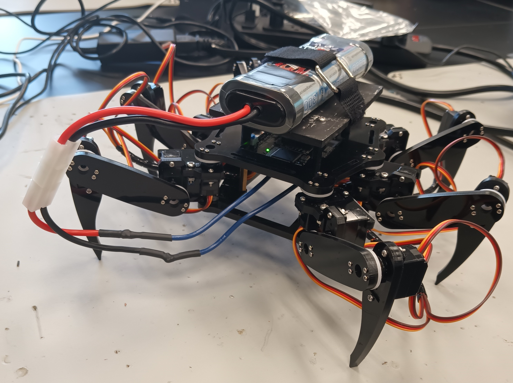

# A.I. Powered Claw Car & Hexapod
<!--Replace this text with a brief description (2-3 sentences) of your project. This description should draw the reader in and make them interested in what you've built. You can include what the biggest challenges, takeaways, and triumphs from completing the project were. As you complete your portfolio, remember your audience is less familiar than you are with all that your project entails!-->

| **Engineer** | **School** | **Area of Interest** | **Grade** |
|:--:|:--:|:--:|:--:|
| Zia S. | Archbishop Mitty Highschool | Computer Engineering | Incoming Sophmore |


  
# Final Milestone (A.I. Powered Claw Car)

<iframe width="901" height="507" src="https://www.youtube.com/embed/uxMxAbv3sPU" title="Zia S. Milestone 3" frameborder="0" allow="accelerometer; autoplay; clipboard-write; encrypted-media; gyroscope; picture-in-picture; web-share" allowfullscreen></iframe>

<iframe width="901" height="507" src="https://www.youtube.com/embed/zHDSXegHkWQ" title="Hexapod Demo" frameborder="0" allow="accelerometer; autoplay; clipboard-write; encrypted-media; gyroscope; picture-in-picture; web-share" allowfullscreen></iframe>


<!--For your final milestone, explain the outcome of your project. Key details to include are:
- What you've accomplished since your previous milestone
- What your biggest challenges and triumphs were at BSE
- A summary of key topics you learned about
- What you hope to learn in the future after everything you've learned at BSE-->

<h1>Summary</h1>
<h2>Project</h2>
My project is an A.I. Powered Claw Car, a robot that travels using 2 wheels controlled by servos and has a claw attached on top. Using a raspberry camera module and an object identification A.I. program, it is capable of identifying various objects based a training data set and pick them up with the claw. <br>

<h2>Components</h2>
<ul>
  <li>Ultrasonic Sensors</li>
  <li>0.96'' OLED Display</li>
  <li>Jumper Cables</li>
  <li>Small Breadboard</li>
</ul>

<h2>How Components Work Together</h2>
&nbsp;&nbsp;&nbsp;&nbsp;&nbsp;The ultrasonic sensors measure distance by sending out a 40,000 hertz sound wave and receives the pulse coming from the echo of the wave. The microcontroller (the controller board) uses a program to calculate the distance by taking the time it took for the sound wave to come back using the equation distance is equal to time divided by 2 (taking into account the wave going back and forth) times the speed of sound (340 m/s). The OLED display uses 8192 bits which turn on or off, and using the Adafruit library, the OLED can be programmed to display text and images by turning off and on certain bits. The system uses the first ultrasonic sensor to get the distance in cm, and then the OLED takes the distance as an integer value and constantly displays the current distance. The Hexapod also uses the distance value to determine when to dance. The first ultrasonic sensor and OLED display are both attached to a cardboard piece each to make it easier to mount to the Hexapod, and the pins poke through to allow connection to the controller board from behind. The other two ultrasonic sensors are attached to mounts which I modeled and 3D printed on both sides of the Hexapod. 

<h2>What I Accomplished</h2> <!-- What I did in previous milestones and what I did for third milestone. -->
&nbsp;&nbsp;&nbsp;&nbsp;&nbsp; In the previous milestones, I assembled and calibrated the Hexapod, programmed a dance, and built a battery stand. For the third milestone, I added three ultrasonic sensors and an OLED display to the Hexapod. I also programmed the Hexapod to display the measured distance on the OLED. I also programmed it to walk around randomly and dance whenever the ultrasonic sensor detects a distance of 5 cm or less. Using the other two sensors, the Hexapod is also able to traverse through hallways, meaning that whenever it reaches a wall, the Hexapod will dance, check for a gap on each side, and turn towards the gap if found; otherwise, the Hexapod would turn 180 degrees and continue walking. Currently, the dance for the Hexapod is just a boogie, but originally it was longer and more varied. I had to change it because it would not be able to go through hallways due to the change in position.  

<h2>Challenges & Triumps</h2>
&nbsp;&nbsp;&nbsp;&nbsp;&nbsp;Some challenges that I had during the project were assembling the Hexapod, building the battery stand, and wire management. I had a lot of trouble attaching the legs to the Hexapod's servo stands; the legs each needed the correct orientation to function properly. It was very tough to fix them on the servo stands correctly; some servos did not fit in the correct direction, and I had to force them into position. It took three days, but I fully assembled the Hexapod and completed the final calibration step to fix any deviations in the legs. The most frustrating part of building the battery holder was measuring the holes correctly. It took me three tries to drill the holes to match the Hexapod's standoffs and fit smoothly. Wire management was time-confusing as the breadboard, which held the ground and power wires, was attached to a cardboard platform at the bottom of the Hexapod. I had to set up the wires from the breadboard so that they were facing the right way for easier connection, but some were too long. As a result, I had to bunch up the wires inside the Hexapod so that the legs did not pull them out which was very frustrating. The same was true for the Trig and Echo pin wires (ultrasonic sensor) and the SDA and SCL pin wires (OLED display). Mounting each device to the Hexapod was challenging as the wires resisted change. It was harder for the two side mounts as I had to cut off the sides of the battery holder to fit the jumper cables for each side ultrasonic sensor; even then, it was still a challenge to screw each mount on. However, I triumphed over these challenges and produced a Hexapod that can measure distance and display it on an OLED display and dance. 

<h2>What I Learned</h2>
&nbsp;&nbsp;&nbsp;&nbsp;&nbsp;I learned many essential topics during the project, such as the basics of Arduino and using breadboards, coding with the Arduino IDE to control different devices such as an ultrasonic sensor, LEDs, and piezo buzzers, how servo motors work, checking for circuit shorts, and using a drill and saw.

<h2>Next Step</h2>
&nbsp;&nbsp;&nbsp;&nbsp;&nbsp; After learning everything I have learned at BlueStamp Engineering, I really hope to learn more advanced concepts in robotics and electrical engineering. <br><br> 

<h2>Hexapod_Ultrasonic2_OLED.ino</h2>

```c++
#include <FNHR.h>
#include <Wire.h>
#include <Adafruit_GFX.h>
#include <Adafruit_SSD1306.h>

#define SCREEN_WIDTH 128 // OLED display width, in pixels
#define SCREEN_HEIGHT 64 // OLED display height, in pixels

// Declaration for an SSD1306 display connected to I2C (SDA, SCL pins)
Adafruit_SSD1306 display(SCREEN_WIDTH, SCREEN_HEIGHT, &Wire, -1);

FNHR robot;

// Sensor 1
const int trigPin1 = 2;
const int echoPin1 = 3;

// Sensor 2
// Have to put in A0 and A1 manually

// Sensor 3
const int trigPin3 = 14;
const int echoPin3 = 15;

long duration;
int distanceCm1;
int distanceCm2;
int distanceCm3;
int danceCm = 8;
bool Walk = true;

void setup() 
{
  // Sensor 1
  pinMode(trigPin1, OUTPUT);
  pinMode(echoPin1, INPUT);

  // Sensor 2
  pinMode(A1, OUTPUT);
  pinMode(A0, INPUT);

  // Sensor 3
  pinMode(trigPin3, OUTPUT);
  pinMode(echoPin3, INPUT);

  // OLED setup
  Serial.begin(115200);

  if(!display.begin(SSD1306_SWITCHCAPVCC, 0x3C)) { // Address 0x3D for 128x64
    Serial.println(F("SSD1306 allocation failed"));
    for(;;);
  }
  delay(2000);
  robot.Start();
  int distanceCm1 = 100;
}
void loop()
{
  // Ultrasonic sensor 1 measuring
  digitalWrite(trigPin1, LOW);
  delayMicroseconds(2);
  digitalWrite(trigPin1, HIGH);
  delayMicroseconds(10);
  digitalWrite(trigPin1, LOW);
  duration = pulseIn(echoPin1, HIGH);
  distanceCm1 = duration * 0.034 / 2;
  Serial.println(distanceCm1);

  // Ultrasonic sensor 2 measuring
  digitalWrite(A1, LOW);
  delayMicroseconds(2);
  digitalWrite(A1, HIGH);
  delayMicroseconds(10);
  digitalWrite(A1, LOW);
  duration = pulseIn(A0, HIGH);
  distanceCm2 = duration * 0.034 / 2;
  Serial.println(distanceCm2);

  // Ultrasonic sensor 3 measuring
  digitalWrite(trigPin3, LOW);
  delayMicroseconds(2);
  digitalWrite(trigPin3, HIGH);
  delayMicroseconds(10);
  digitalWrite(trigPin3, LOW);
  duration = pulseIn(echoPin3, HIGH);
  distanceCm3 = duration * 0.034 / 2;
  Serial.println(distanceCm3);

  // Robot walking around randomly and checking sides
  if (distanceCm1 > danceCm && Walk == true)
  {
    robot.CrawlForward();
  }
  else
  {
    Walk = false;
    MiniDance();
    robot.ChangeBodyHeight(50);
    delay(100);
    
    if (distanceCm2 > danceCm)
    {
      for (int i = 0; i < 16; i++)
     {
       robot.TurnRight();
     }
     Walk = true;
    }
    else if (distanceCm3 > danceCm)
    {
      for (int i = 0; i < 16; i++)
     {
       robot.TurnLeft();
     }
     Walk = true;
    }
    else
    {
      for (int i = 0; i < 32; i++)
     {
       robot.TurnRight();
     }
     Walk = true;
    }
  }
  
  // Distance is less than 10
  if (distanceCm1 < 10)
  {
    display.clearDisplay();
    display.setTextSize(9);
    display.setTextColor(WHITE);
    display.setCursor(40, 0);
    display.print(distanceCm1);
    display.display(); 
  }

  // Distance more or equal to 10 and less than 100
  if (distanceCm1 >= 10 && distanceCm1 < 100)
  {
    display.clearDisplay();
    display.setTextSize(9);
    display.setTextColor(WHITE);
    display.setCursor(15, 0);
    display.print(distanceCm1);
    display.display(); 
  }

  // Distance more or equal to 100 and less or equal to than 400
  if (distanceCm1 >= 100 && distanceCm1 <= 400)
  {
    display.clearDisplay();
    display.setTextSize(7);
    display.setTextColor(WHITE);
    display.setCursor(1, 10);
    display.print(distanceCm1);
    display.display(); 
  }

  // Distance more than 400
  if (distanceCm1 > 400)
  {
    display.clearDisplay();
    display.setTextSize(4);
    display.setTextColor(WHITE);
    display.setCursor(30, 0);
    display.println("Too");
    display.setCursor(30,30);
    display.println("Far");
    display.display(); 
  }
  
}

void MiniDance()
{
  robot.SetActionSpeed(50);

  delay(500);

  //Max height is 50

  // Dance Move 1
  for (int i = 0; i < 3; i++)
  {
    robot.SetActionSpeed(200);
    robot.ChangeBodyHeight(50);
    robot.ChangeBodyHeight(30);
  }
}

```

<!--**Don't forget to replace the text below with the embedding for your milestone video. Go to Youtube, click Share -> Embed, and copy and paste the code to replace what's below.**-->

# Second Milestone (A.I. Powered Claw Car)

<iframe width="901" height="507" src="https://www.youtube.com/watch?v=mGiasDcI_J0" title="Zia S. Milestone 2" frameborder="0" allow="accelerometer; autoplay; clipboard-write; encrypted-media; gyroscope; picture-in-picture; web-share" allowfullscreen></iframe>

<p float="left">
   
</p>

<h1>Summary</h1>
<h2>Project</h2>
My project is an A.I. Powered Claw Car, a robot that travels using 2 wheels controlled by servos and has a claw attached on top. Using a raspberry camera module and an object identification A.I. program, it is capable of identifying various objects based a training data set and pick them up with the claw. <br>

<h2>Components</h2>
<ul>
  <li>Acrylic Plates</li>
  <li>Arduino Nano</li>
  <li>Arduino Shield</li>
  <li>Servo Package</li>
  <li>Joysticks</li>
  <li>USB Cable</li>
  <li>Jumper Cables</li>
  <li>Battery Case</li>
  <li>AA Batteries</li>
  <li>Turntable</li>
</ul>

<h2>How Components Work Together</h2>
&nbsp;&nbsp;&nbsp;&nbsp;&nbsp; The acrylic parts of the claw act as the base and main body that house the servos, Arduino Nano, and Arduino shield. The base of the claw has a servo that rotates a ball-bearing wheel, rotatating the entire claw. Two other servos control the arm of the claw, making it capable of moving up or down. The final servo controls the actual claw; it is attached to one claw half with a gear at the end that is in contact with the gear of the other claw half so when the servo rotates, the entire claw grabs or releases. The servos are controlled by two joysticks that are connected to the Arduino Nano; one controls the rotation and position of the claw arm and the other control the claw itself. 

<h2>Progress</h2>
&nbsp;&nbsp;&nbsp;&nbsp;&nbsp;For the second milestone, I had to cut the ground and voltage wires of the battery port of the claw and solder them to a new battery case as lithium batteries are not allowed in Bluestamp projects. Before beginning assembly, I used the Arduino program, Servo_90_ADJ.ino, provided by the pdf claw tutorial to adjust the servos to all be 90°, using a USB to connect the Arduino Nano to my computer. I then assembled the stand for the Arduino Nano and shield using standoffs and did the same for the ball-bearing base of the claw arm. Next, I added the servo for the base of the claw arm and attached a rectangular piece to it that would allow the servo to rotate the entire base. I then screwed together the claw arm with two servos, making sure that they were straight. Finally, I screwed in the servo for the claw and attached the claw half to it and lined up the other half with the first. I then assembled a simple controller using one of the acrylic plates and screwing in two joysticks. I then did the necessary wiring for the claw to properly work and be controllled by the claw. I uploaded the Arduino program, Arm.ino, provided by the tutorial to the Arduino Nano, allowing me to control the claw with the joysticks. 

<h2>Challenges Faced</h2>
&nbsp;&nbsp;&nbsp;&nbsp;&nbsp;One of the major problems I faced with the claw assembly was screwing in small screws into tiny nuts in tight spaces. It was quite difficult for me and wasted a lot of time. Eventually, I figured out a way to make it easier by always turning the claw over to a side in which the nut would be lying down to facilitate the screwing process. Another problem I faced was accidently attached the rectangular piece the wrong way on the base servo. This was an issue because one, the traction of the servo and the ball-bearing base was weak, leading to little rotation, and two, removing the servo arm from the rectangular piece is difficult. The servo arm is attached to the retangular piece using self-tapping screws which are difficult to remove once they are screwed in. It also did not help that the screwdriver I was using broke away from the handle, making it ineffective. I wasted more time trying to remove the self-tapping screws but managed to get them out using a plier that had a good grip on them. <br>

<h2>Next Step</h2>
&nbsp;&nbsp;&nbsp;&nbsp;&nbsp;My third milestone will be mounting the claw onto the car and programming them to be controlled by the same controller by making communication between the Arduino Uno of the car and Arduino Nano of the claw possible. I must learn how to make communication between two Arduino board possible and how to make a custom controller for the robot. <br> <br>

<h2>Servo_90_ADJ.ino</h2>

```c++
//
/*
 * This code applies to cokoino mechanical arm
 * Through this link you can download the source code:
 * https://github.com/Cokoino/CKK0006
 * Company web site:
 * http://cokoino.com/

#include<Servo.h>
Servo myservo1;  // Create a servo class
Servo myservo2;  // Create a servo class
Servo myservo3;  // Create a servo class
Servo myservo4;  // Create a servo class

void setup() {  
myservo1.attach(4);  //Set the servo control pin as D4
myservo2.attach(5);  //Set the servo control pin as D5
myservo3.attach(6);  //Set the servo control pin as D6
myservo4.attach(7);  //Set the servo control pin as D7
delay(100);          //delay 100ms 
}
/////////////////////////////////////////////////////////
void loop() {
 myservo1.write(90);  //The servo is 90 degrees
 myservo2.write(90);  //The servo is 90 degrees
 myservo3.write(90);  //The servo is 90 degrees
 myservo4.write(90);  //The servo is 90 degrees
 delay(1000);
 }
```

<h2>Arm.ino</h2>

```c++
/*
 * This code applies to cokoino mechanical arm
 * Through this link you can download the source code:
 * https://github.com/Cokoino/CKK0006
 * Company web site:
 * http://cokoino.com/
 *                                     ________
 *                         ----|servo4| 
 *                        |            --------
 *                    |servo3|   
 *                        |
 *                        |
 *                    |servo2|
 *                        |
 *                        |
 *                  ___________
 *                  |  servo1 |
 *         ____________________
 *         ____________________
 * Fanctions:
 * arm.servo1.read();   //read the servo of angle
 * arm.servo2.read();
 * arm.servo3.read();
 * arm.servo4.read();
 * 
 * arm.servo1.write(angle);   //servo run
 * arm.servo2.write(angle);
 * arm.servo3.write(angle);
 * arm.servo4.write(angle);
 * 
 * arm.left(speed);    //perform the action 
 * arm.right(speed);
 * arm.up(speed);
 * arm.down(speed);
 * arm.open(speed);
 * arm.close(speed);
 * 
 * arm.captureAction();    //capture the current action,return pointer array
 * arm.do_action(int *p,int speed);  //P is a pointer to the array
 * 
 * arm.JoyStickL.read_x(); //Returns joystick numerical
 * arm.JoyStickL.read_y();
 * arm.JoyStickR.read_x();
 * arm.JoyStickR.read_y();
 */
#include "src/CokoinoArm.h"
#define buzzerPin 9

CokoinoArm arm;
int xL,yL,xR,yR;

const int act_max=10;    //Default 10 action,4 the Angle of servo
int act[act_max][4];    //Only can change the number of action
int num=0,num_do=0;
///////////////////////////////////////////////////////////////
void turnUD(void){
  if(xL!=512){
    if(0<=xL && xL<=100){arm.up(10);return;}
    if(900<xL && xL<=1024){arm.down(10);return;} 
    if(100<xL && xL<=200){arm.up(20);return;}
    if(800<xL && xL<=900){arm.down(20);return;}
    if(200<xL && xL<=300){arm.up(25);return;}
    if(700<xL && xL<=800){arm.down(25);return;}
    if(300<xL && xL<=400){arm.up(30);return;}
    if(600<xL && xL<=700){arm.down(30);return;}
    if(400<xL && xL<=480){arm.up(35);return;}
    if(540<xL && xL<=600){arm.down(35);return;} 
    }
}
///////////////////////////////////////////////////////////////
void turnLR(void){
  if(yL!=512){
    if(0<=yL && yL<=100){arm.right(0);return;}
    if(900<yL && yL<=1024){arm.left(0);return;}  
    if(100<yL && yL<=200){arm.right(5);return;}
    if(800<yL && yL<=900){arm.left(5);return;}
    if(200<yL && yL<=300){arm.right(10);return;}
    if(700<yL && yL<=800){arm.left(10);return;}
    if(300<yL && yL<=400){arm.right(15);return;}
    if(600<yL && yL<=700){arm.left(15);return;}
    if(400<yL && yL<=480){arm.right(20);return;}
    if(540<yL && yL<=600){arm.left(20);return;}
  }
}
///////////////////////////////////////////////////////////////
void turnCO(void){
  if(xR!=512){
    if(0<=xR && xR<=100){arm.close(0);return;}
    if(900<xR && xR<=1024){arm.open(0);return;} 
    if(100<xR && xR<=200){arm.close(5);return;}
    if(800<xR && xR<=900){arm.open(5);return;}
    if(200<xR && xR<=300){arm.close(10);return;}
    if(700<xR && xR<=800){arm.open(10);return;}
    if(300<xR && xR<=400){arm.close(15);return;}
    if(600<xR && xR<=700){arm.open(15);return;}
    if(400<xR && xR<=480){arm.close(20);return;}
    if(540<xR && xR<=600){arm.open(20);return;} 
    }
}
///////////////////////////////////////////////////////////////
void date_processing(int *x,int *y){
  if(abs(512-*x)>abs(512-*y))
    {*y = 512;}
  else
    {*x = 512;}
}
///////////////////////////////////////////////////////////////
void buzzer(int H,int L){
  while(yR<420){
    digitalWrite(buzzerPin,HIGH);
    delayMicroseconds(H);
    digitalWrite(buzzerPin,LOW);
    delayMicroseconds(L);
    yR = arm.JoyStickR.read_y();
    }
  while(yR>600){
    digitalWrite(buzzerPin,HIGH);
    delayMicroseconds(H);
    digitalWrite(buzzerPin,LOW);
    delayMicroseconds(L);
    yR = arm.JoyStickR.read_y();
    }
}
///////////////////////////////////////////////////////////////
void C_action(void){
  if(yR>800){
    int *p;
    p=arm.captureAction();
    for(char i=0;i<4;i++){
    act[num][i]=*p;
    p=p+1;     
    }
    num++;
    num_do=num;
    if(num>=act_max){
      num=0;
      buzzer(600,400);
      }
    while(yR>600){yR = arm.JoyStickR.read_y();}
    //Serial.println(act[0][0]);
  }
}
///////////////////////////////////////////////////////////////
void Do_action(void){
  if(yR<220){
    buzzer(200,300);
    for(int i=0;i<num_do;i++){
      arm.do_action(act[i],15);
      }
    num=0;
    while(yR<420){yR = arm.JoyStickR.read_y();}
    for(int i=0;i<2000;i++){
      digitalWrite(buzzerPin,HIGH);
      delayMicroseconds(200);
      digitalWrite(buzzerPin,LOW);
      delayMicroseconds(300);        
    }
  }
}
///////////////////////////////////////////////////////////////
void setup() {
  //Serial.begin(9600);
  //arm of servo motor connection pins
  arm.ServoAttach(4,5,6,7);
  //arm of joy stick connection pins : xL,yL,xR,yR
  arm.JoyStickAttach(A0,A1,A2,A3);
  pinMode(buzzerPin,OUTPUT);
}
///////////////////////////////////////////////////////////////
void loop() {
  xL = arm.JoyStickL.read_x();
  yL = arm.JoyStickL.read_y();
  xR = arm.JoyStickR.read_x();
  yR = arm.JoyStickR.read_y();
  date_processing(&xL,&yL);
  date_processing(&xR,&yR);
  turnUD();
  turnLR();
  turnCO();
  C_action();
  Do_action();
}
```

# First Milestone (A.I. Powered Claw Car)

<iframe width="901" height="507" src="https://www.youtube.com/watch?v=jHtg-IWIxA0" title="Zia S. First Milestone" frameborder="0" allow="accelerometer; autoplay; clipboard-write; encrypted-media; gyroscope; picture-in-picture; web-share" allowfullscreen></iframe>


<h1>Summary</h1>

<h2>Project</h2>
My project is an A.I. Powered Claw Car, a robot that travels using 2 wheels controlled by servos and has a claw attached on top. Using a raspberry camera module and an object identification A.I. program, it is capable of identifying various objects based a training data set and pick them up with the claw. <br>

<h2>Components</h2>
<ul>
  <li>Acrylic Plate</li>
  <li>Arduino Uno</li>
  <li>Mini Breadboard</li>
  <li>TT Wheel</li>
  <li>1" Wheel</li>
  <li>TT Motor</li>
  <li>WLAN Module</li>
  <li>USB Cable</li>
  <li>Jumper Cables</li>
  <li>9V Battery</li>
  <li>IR Reciever</li>
  <li>IR Controller</li>
  <li>Velcro</li>
</ul> <br>

<h2>How Components Work Together</h2>
&nbsp;&nbsp;&nbsp;&nbsp;&nbsp; The acrylic plate acts as the base of the car; everything including the servos, Arduino Uno, mini breadboard, L9110 module, universal wheel, and 9V Battery is attached to it. Whenever a button is pressed on the IR controller, the IR reciever recieves the signal and sends it to the Arduino Uno. The Uno then processes the signal and depending on the button pressed, sends a signal to the L9110 module with the specific activation truth table. This activates the motors and moves the car. 

<h2>Progress</h2>
&nbsp;&nbsp;&nbsp;&nbsp;&nbsp;For the first milestone, I assembled the whole car and downloaded the necessary software, such as the Arduino library IRRemote and the Processing IDE, to control the car using the IR remote. 
<h2>Challenges Faced</h2>
&nbsp;&nbsp;&nbsp;&nbsp;&nbsp; I had a few troubles attaching the motors to the acrylic plate as the window for attachment was very tight and took me a bit to attach. I also wasted much time looking for specific standoffs that were missing from my kit that were needed for the universal wheel and ended up having to use slightly longer standoffs. 

<h2>Next Step</h2>
&nbsp;&nbsp;&nbsp;&nbsp;&nbsp;The next step is completing my second milestone: assembling the claw and programming it.<br><br>

<h2>Car_Remote_Control.ino</h2>
  
```c++
#include <IRremote.h>

const int IR_RECEIVE_PIN = 12;  // Define the pin number for the IR Sensor

const int A_1B = 5;
const int A_1A = 6;
const int B_1B = 9;
const int B_1A = 10;


int speed = 150;

void setup() {
  Serial.begin(9600);

  //motor
  pinMode(A_1B, OUTPUT);
  pinMode(A_1A, OUTPUT);
  pinMode(B_1B, OUTPUT);
  pinMode(B_1A, OUTPUT);

  //IR remote
  IrReceiver.begin(IR_RECEIVE_PIN, ENABLE_LED_FEEDBACK);  // Start the IR receiver // Start the receiver
  Serial.println("REMOTE CONTROL START");

}

void loop() {

  if (IrReceiver.decode()) {
    //    Serial.println(results.value,HEX);
    String key = decodeKeyValue(IrReceiver.decodedIRData.command);
    if (key != "ERROR") {
      Serial.println(key);

      if (key == "+") {
        speed += 50;
      } else if (key == "-") {
        speed -= 50;
      } else if (key == "2") {
        moveForward(speed);
        delay(1000);
      } else if (key == "1") {
        moveLeft(speed);
      } else if (key == "3") {
        moveRight(speed);
      } else if (key == "4") {
        turnLeft(speed);
      } else if (key == "6") {
        turnRight(speed);
      } else if (key == "7") {
        backLeft(speed);
      } else if (key == "9") {
        backRight(speed);
      } else if (key == "8") {
        moveBackward(speed);
        delay(1000);
      }

      if (speed >= 255) {
        speed = 255;
      }
      if (speed <= 0) {
        speed = 0;
      }
      delay(500);
      stopMove();
    }

    IrReceiver.resume();  // Enable receiving of the next value
  }
}

void moveForward(int speed) {
  analogWrite(A_1B, 0);
  analogWrite(A_1A, speed);
  analogWrite(B_1B, speed);
  analogWrite(B_1A, 0);
}

void moveBackward(int speed) {
  analogWrite(A_1B, speed);
  analogWrite(A_1A, 0);
  analogWrite(B_1B, 0);
  analogWrite(B_1A, speed);
}

void turnRight(int speed) {
  analogWrite(A_1B, speed);
  analogWrite(A_1A, 0);
  analogWrite(B_1B, speed);
  analogWrite(B_1A, 0);
}

void turnLeft(int speed) {
  analogWrite(A_1B, 0);
  analogWrite(A_1A, speed);
  analogWrite(B_1B, 0);
  analogWrite(B_1A, speed);
}

void moveLeft(int speed) {
  analogWrite(A_1B, 0);
  analogWrite(A_1A, speed);
  analogWrite(B_1B, 0);
  analogWrite(B_1A, 0);
}

void moveRight(int speed) {
  analogWrite(A_1B, 0);
  analogWrite(A_1A, 0);
  analogWrite(B_1B, speed);
  analogWrite(B_1A, 0);
}

void backLeft(int speed) {
  analogWrite(A_1B, speed);
  analogWrite(A_1A, 0);
  analogWrite(B_1B, 0);
  analogWrite(B_1A, 0);
}

void backRight(int speed) {
  analogWrite(A_1B, 0);
  analogWrite(A_1A, 0);
  analogWrite(B_1B, 0);
  analogWrite(B_1A, speed);
}

void stopMove() {
  analogWrite(A_1B, 0);
  analogWrite(A_1A, 0);
  analogWrite(B_1B, 0);
  analogWrite(B_1A, 0);
}


String decodeKeyValue(long result)
{
  switch(result){
    case 0x16:
      return "0";
    case 0xC:
      return "1"; 
    case 0x18:
      return "2"; 
    case 0x5E:
      return "3"; 
    case 0x8:
      return "4"; 
    case 0x1C:
      return "5"; 
    case 0x5A:
      return "6"; 
    case 0x42:
      return "7"; 
    case 0x52:
      return "8"; 
    case 0x4A:
      return "9"; 
    case 0x9:
      return "+"; 
    case 0x15:
      return "-"; 
    case 0x7:
      return "EQ"; 
    case 0xD:
      return "U/SD";
    case 0x19:
      return "CYCLE";         
    case 0x44:
      return "PLAY/PAUSE";   
    case 0x43:
      return "FORWARD";   
    case 0x40:
      return "BACKWARD";   
    case 0x45:
      return "POWER";   
    case 0x47:
      return "MUTE";   
    case 0x46:
      return "MODE";       
    case 0x0:
      return "ERROR";   
    default :
      return "ERROR";
    }
}
}

```

<!--# Schematics 
Here's where you'll put images of your schematics. [Tinkercad](https://www.tinkercad.com/blog/official-guide-to-tinkercad-circuits) and [Fritzing](https://fritzing.org/learning/) are both great resoruces to create professional schematic diagrams, though BSE recommends Tinkercad becuase it can be done easily and for free in the browser. 


# Bill of Materials
Here's where you'll list the parts in your project. To add more rows, just copy and paste the example rows below.
Don't forget to place the link of where to buy each component inside the quotation marks in the corresponding row after href =. Follow the guide [here]([url](https://www.markdownguide.org/extended-syntax/)) to learn how to customize this to your project needs. 

| **Part** | **Note** | **Price** | **Link** |
|:--:|:--:|:--:|:--:|
| Item Name | What the item is used for | $Price | <a href="https://www.amazon.com/Arduino-A000066-ARDUINO-UNO-R3/dp/B008GRTSV6/"> Link </a> |
|:--:|:--:|:--:|:--:|
| Item Name | What the item is used for | $Price | <a href="https://www.amazon.com/Arduino-A000066-ARDUINO-UNO-R3/dp/B008GRTSV6/"> Link </a> |
|:--:|:--:|:--:|:--:|
| Item Name | What the item is used for | $Price | <a href="https://www.amazon.com/Arduino-A000066-ARDUINO-UNO-R3/dp/B008GRTSV6/"> Link </a> |
|:--:|:--:|:--:|:--:|-->

# Starter Project (Retro Arcade Console)

<iframe width="901" height="507" src="https://www.youtube.com/watch?v=hHAm_oHuuT8&t=85s" title="Zia S. Starter Project" frameborder="0" allow="accelerometer; autoplay; clipboard-write; encrypted-media; gyroscope; picture-in-picture; web-share" allowfullscreen></iframe>


My Starter Project is the Retro Arcade Console which uses multiple buttons, a digitron display, 2 dot matrixes, and a buzzer to create a full-on gaming experience with 5 retro games including Tetris and Snake.  

Materials:
* 1 Buzzer
* 1 220uF 16V Capacitor
* 1 Micro USB
* 1 Power Cable
* 1 Self-switch
* 1 Self-switch cap
* 1 Digitron display
* IC Chip
* 2 LED dot matrix modules
* 6 Buttons
* 6 Button caps
* 1 PCB
* 8 M3x5mm Screws
* 2 M3x8mm Screws
* 4 Copper columns
* 4 Hexagonal columns
* 1 Battery Case
* 6 Acrylic shells
* 1 Solder & Soldering Iron
* 1 Screwdriver

Procedure: 
1. First, I soldered all of the main parts to the PCB; I soldered the 6 buttons, then the micro USB, then the capacitor, then the self-lock switch, then the digitron display, and finally the dot matrix modules.
2. Second, I soldered the ground and voltage wires of the battery case to the PCB, attached the case to an acrylic shell using screws, and attached the button caps to all of the buttons.
3. Finally, I assembled the acyrlic cage using mutiples screws and columns to space out the console. 


<!--# Other Resources/Examples
One of the best parts about Github is that you can view how other people set up their own work. Here are some past BSE portfolios that are awesome examples. You can view how they set up their portfolio, and you can view their index.md files to understand how they implemented different portfolio components.
- [Example 1](https://trashytuber.github.io/YimingJiaBlueStamp/)
- [Example 2](https://sviatil0.github.io/Sviatoslav_BSE/)
- [Example 3](https://arneshkumar.github.io/arneshbluestamp/)

To watch the BSE tutorial on how to create a portfolio, click here.-->

| **Engineer** | **School** | **Area of Interest** | **Grade** |
|:--:|:--:|:--:|:--:|
| Zia S. | Archbishop Mitty Highschool | Computer Engineering | Incoming Freshman |


# Final Milestone (Hexapod)

<iframe width="901" height="507" src="https://www.youtube.com/embed/uxMxAbv3sPU" title="Zia S. Milestone 3" frameborder="0" allow="accelerometer; autoplay; clipboard-write; encrypted-media; gyroscope; picture-in-picture; web-share" allowfullscreen></iframe>

<iframe width="901" height="507" src="https://www.youtube.com/embed/zHDSXegHkWQ" title="Hexapod Demo" frameborder="0" allow="accelerometer; autoplay; clipboard-write; encrypted-media; gyroscope; picture-in-picture; web-share" allowfullscreen></iframe>


<!--For your final milestone, explain the outcome of your project. Key details to include are:
- What you've accomplished since your previous milestone
- What your biggest challenges and triumphs were at BSE
- A summary of key topics you learned about
- What you hope to learn in the future after everything you've learned at BSE-->

<h1>Summary</h1>
<h2>Project</h2>
My project is the Hexapod, a robot that walks on 6 legs using multiple servos and can be controlled with a computer, remote, and phone. <br>

<h2>Components</h2>
<ul>
  <li>Ultrasonic Sensors</li>
  <li>0.96'' OLED Display</li>
  <li>Jumper Cables</li>
  <li>Small Breadboard</li>
</ul>

<h2>How Components Work Together</h2>
&nbsp;&nbsp;&nbsp;&nbsp;&nbsp;The ultrasonic sensors measure distance by sending out a 40,000 hertz sound wave and receives the pulse coming from the echo of the wave. The microcontroller (the controller board) uses a program to calculate the distance by taking the time it took for the sound wave to come back using the equation distance is equal to time divided by 2 (taking into account the wave going back and forth) times the speed of sound (340 m/s). The OLED display uses 8192 bits which turn on or off, and using the Adafruit library, the OLED can be programmed to display text and images by turning off and on certain bits. The system uses the first ultrasonic sensor to get the distance in cm, and then the OLED takes the distance as an integer value and constantly displays the current distance. The Hexapod also uses the distance value to determine when to dance. The first ultrasonic sensor and OLED display are both attached to a cardboard piece each to make it easier to mount to the Hexapod, and the pins poke through to allow connection to the controller board from behind. The other two ultrasonic sensors are attached to mounts which I modeled and 3D printed on both sides of the Hexapod. 

<h2>What I Accomplished</h2> <!-- What I did in previous milestones and what I did for third milestone. -->
&nbsp;&nbsp;&nbsp;&nbsp;&nbsp; In the previous milestones, I assembled and calibrated the Hexapod, programmed a dance, and built a battery stand. For the third milestone, I added three ultrasonic sensors and an OLED display to the Hexapod. I also programmed the Hexapod to display the measured distance on the OLED. I also programmed it to walk around randomly and dance whenever the ultrasonic sensor detects a distance of 5 cm or less. Using the other two sensors, the Hexapod is also able to traverse through hallways, meaning that whenever it reaches a wall, the Hexapod will dance, check for a gap on each side, and turn towards the gap if found; otherwise, the Hexapod would turn 180 degrees and continue walking. Currently, the dance for the Hexapod is just a boogie, but originally it was longer and more varied. I had to change it because it would not be able to go through hallways due to the change in position.  

<h2>Challenges & Triumps</h2>
&nbsp;&nbsp;&nbsp;&nbsp;&nbsp;Some challenges that I had during the project were assembling the Hexapod, building the battery stand, and wire management. I had a lot of trouble attaching the legs to the Hexapod's servo stands; the legs each needed the correct orientation to function properly. It was very tough to fix them on the servo stands correctly; some servos did not fit in the correct direction, and I had to force them into position. It took three days, but I fully assembled the Hexapod and completed the final calibration step to fix any deviations in the legs. The most frustrating part of building the battery holder was measuring the holes correctly. It took me three tries to drill the holes to match the Hexapod's standoffs and fit smoothly. Wire management was time-confusing as the breadboard, which held the ground and power wires, was attached to a cardboard platform at the bottom of the Hexapod. I had to set up the wires from the breadboard so that they were facing the right way for easier connection, but some were too long. As a result, I had to bunch up the wires inside the Hexapod so that the legs did not pull them out which was very frustrating. The same was true for the Trig and Echo pin wires (ultrasonic sensor) and the SDA and SCL pin wires (OLED display). Mounting each device to the Hexapod was challenging as the wires resisted change. It was harder for the two side mounts as I had to cut off the sides of the battery holder to fit the jumper cables for each side ultrasonic sensor; even then, it was still a challenge to screw each mount on. However, I triumphed over these challenges and produced a Hexapod that can measure distance and display it on an OLED display and dance. 

<h2>What I Learned</h2>
&nbsp;&nbsp;&nbsp;&nbsp;&nbsp;I learned many essential topics during the project, such as the basics of Arduino and using breadboards, coding with the Arduino IDE to control different devices such as an ultrasonic sensor, LEDs, and piezo buzzers, how servo motors work, checking for circuit shorts, and using a drill and saw.

<h2>Next Step</h2>
&nbsp;&nbsp;&nbsp;&nbsp;&nbsp; After learning everything I have learned at BlueStamp Engineering, I really hope to learn more advanced concepts in robotics and electrical engineering. <br><br> 

<h2>Hexapod_Ultrasonic2_OLED.ino</h2>

```c++
#include <FNHR.h>
#include <Wire.h>
#include <Adafruit_GFX.h>
#include <Adafruit_SSD1306.h>

#define SCREEN_WIDTH 128 // OLED display width, in pixels
#define SCREEN_HEIGHT 64 // OLED display height, in pixels

// Declaration for an SSD1306 display connected to I2C (SDA, SCL pins)
Adafruit_SSD1306 display(SCREEN_WIDTH, SCREEN_HEIGHT, &Wire, -1);

FNHR robot;

// Sensor 1
const int trigPin1 = 2;
const int echoPin1 = 3;

// Sensor 2
// Have to put in A0 and A1 manually

// Sensor 3
const int trigPin3 = 14;
const int echoPin3 = 15;

long duration;
int distanceCm1;
int distanceCm2;
int distanceCm3;
int danceCm = 8;
bool Walk = true;

void setup() 
{
  // Sensor 1
  pinMode(trigPin1, OUTPUT);
  pinMode(echoPin1, INPUT);

  // Sensor 2
  pinMode(A1, OUTPUT);
  pinMode(A0, INPUT);

  // Sensor 3
  pinMode(trigPin3, OUTPUT);
  pinMode(echoPin3, INPUT);

  // OLED setup
  Serial.begin(115200);

  if(!display.begin(SSD1306_SWITCHCAPVCC, 0x3C)) { // Address 0x3D for 128x64
    Serial.println(F("SSD1306 allocation failed"));
    for(;;);
  }
  delay(2000);
  robot.Start();
  int distanceCm1 = 100;
}
void loop()
{
  // Ultrasonic sensor 1 measuring
  digitalWrite(trigPin1, LOW);
  delayMicroseconds(2);
  digitalWrite(trigPin1, HIGH);
  delayMicroseconds(10);
  digitalWrite(trigPin1, LOW);
  duration = pulseIn(echoPin1, HIGH);
  distanceCm1 = duration * 0.034 / 2;
  Serial.println(distanceCm1);

  // Ultrasonic sensor 2 measuring
  digitalWrite(A1, LOW);
  delayMicroseconds(2);
  digitalWrite(A1, HIGH);
  delayMicroseconds(10);
  digitalWrite(A1, LOW);
  duration = pulseIn(A0, HIGH);
  distanceCm2 = duration * 0.034 / 2;
  Serial.println(distanceCm2);

  // Ultrasonic sensor 3 measuring
  digitalWrite(trigPin3, LOW);
  delayMicroseconds(2);
  digitalWrite(trigPin3, HIGH);
  delayMicroseconds(10);
  digitalWrite(trigPin3, LOW);
  duration = pulseIn(echoPin3, HIGH);
  distanceCm3 = duration * 0.034 / 2;
  Serial.println(distanceCm3);

  // Robot walking around randomly and checking sides
  if (distanceCm1 > danceCm && Walk == true)
  {
    robot.CrawlForward();
  }
  else
  {
    Walk = false;
    MiniDance();
    robot.ChangeBodyHeight(50);
    delay(100);
    
    if (distanceCm2 > danceCm)
    {
      for (int i = 0; i < 16; i++)
     {
       robot.TurnRight();
     }
     Walk = true;
    }
    else if (distanceCm3 > danceCm)
    {
      for (int i = 0; i < 16; i++)
     {
       robot.TurnLeft();
     }
     Walk = true;
    }
    else
    {
      for (int i = 0; i < 32; i++)
     {
       robot.TurnRight();
     }
     Walk = true;
    }
  }
  
  // Distance is less than 10
  if (distanceCm1 < 10)
  {
    display.clearDisplay();
    display.setTextSize(9);
    display.setTextColor(WHITE);
    display.setCursor(40, 0);
    display.print(distanceCm1);
    display.display(); 
  }

  // Distance more or equal to 10 and less than 100
  if (distanceCm1 >= 10 && distanceCm1 < 100)
  {
    display.clearDisplay();
    display.setTextSize(9);
    display.setTextColor(WHITE);
    display.setCursor(15, 0);
    display.print(distanceCm1);
    display.display(); 
  }

  // Distance more or equal to 100 and less or equal to than 400
  if (distanceCm1 >= 100 && distanceCm1 <= 400)
  {
    display.clearDisplay();
    display.setTextSize(7);
    display.setTextColor(WHITE);
    display.setCursor(1, 10);
    display.print(distanceCm1);
    display.display(); 
  }

  // Distance more than 400
  if (distanceCm1 > 400)
  {
    display.clearDisplay();
    display.setTextSize(4);
    display.setTextColor(WHITE);
    display.setCursor(30, 0);
    display.println("Too");
    display.setCursor(30,30);
    display.println("Far");
    display.display(); 
  }
  
}

void MiniDance()
{
  robot.SetActionSpeed(50);

  delay(500);

  //Max height is 50

  // Dance Move 1
  for (int i = 0; i < 3; i++)
  {
    robot.SetActionSpeed(200);
    robot.ChangeBodyHeight(50);
    robot.ChangeBodyHeight(30);
  }
}

```

<!--**Don't forget to replace the text below with the embedding for your milestone video. Go to Youtube, click Share -> Embed, and copy and paste the code to replace what's below.**-->

# Second Milestone (Hexapod)

<iframe width="901" height="507" src="https://www.youtube.com/embed/BK9GC6PL-00" title="Zia S. Milestone 2" frameborder="0" allow="accelerometer; autoplay; clipboard-write; encrypted-media; gyroscope; picture-in-picture; web-share" allowfullscreen></iframe>

<p float="left">
  
   
</p>

<h1>Summary</h1>
<h2>Project</h2>
My project is the Hexapod, a robot that walks on 6 legs using multiple servos and can be controlled with a computer, remote, and phone. <br>

<h2>Components</h2>
<ul>
  <li>Acrylic Parts</li>
  <li>Calibration Graph</li>
  <li>Servo Package</li>
  <li>Freenove Crawling Robot Controller</li>
  <li>WLAN Module</li>
  <li>USB Cable</li>
</ul>

<h2>How Components Work Together</h2>
&nbsp;&nbsp;&nbsp;&nbsp;&nbsp;The acrylic parts make up the body of the Hexapod and hold the servos and robot controller in place. The robot controller controls all of the servos in order to perform actions such as walking, turning, or raising body height. The WLAN module that is attached to the Hexapod creates a hotspot that can be connected to through a computer or phone and then the Hexapod can be controlled through an app or the Processing software on the computer. The USB cable allows for Arduino sketches to be uploaded to the robot controller so that the Hexapod can have a custom program. 

<h2>Progress</h2>
&nbsp;&nbsp;&nbsp;&nbsp;&nbsp;For the second milestone, I cut out and drilled a battery holder that goes on top of the Hexapod to hold the 7.2 volt battery. The Hexapod is now able to move around without being dragged down by the battery. I also programmed a dance for the Hexapod using the FNHR library to access functions that control certain aspects of the Hexapod's movement, such as walking and turning. Only a few hours were necessary to program the dance, and I then uploaded the sketch to the control board so that whenever I turn on the Hexapod, it does a dance using many functions such as a robot.CrawlForward and robot.Rotate().

<h2>Challenges Faced</h2>
&nbsp;&nbsp;&nbsp;&nbsp;&nbsp;At first, I used Onshape, a 3D modeling software, to design a battery holder for the Hexapod. I later found out that due to the model's overhangs, it would take a very long time to 3D print the model and the necessary supports. With this in mind, I created a new 3D model for the battery holder, a plate with holes that fit screws, and the battery is held down to the plate using a hot-glued velcro strap. Although, one of my mentors, Ricky, said that it would be faster to cut out a wood plate by hand rather than print it since the 3D model was not intricate enough to justify using a 3D printer. The first time I cut out a battery holder and drilled holes for the screws, the holes did not match with Hexapod so I had to make a new plate. The second plate's also did not match and I later found out that I was using the wrong side of the caliper, a digital ruler, for measuring. For the third plate, I had to be very precise with the measurements, down to the micrometer. <br>

<h2>Next Step</h2>
&nbsp;&nbsp;&nbsp;&nbsp;&nbsp;With the battery holder, the Hexapod can now go anywhere, contributing to my final milestone: adding an ultrasound sensor to the Hexapod and programming it to randomly walk around a room and use the ultrasound sensor to determine when it should dance. The second part of the final milestone is adding an LCD (Liquid Crystal Display) that shows what distance the ultrasound sensor measures. Before starting my final milestone, I need to learn more about ultrasound sensors and LCDs, how they work, and how to program them with Arduino. <br> <br>

<!--

-->

<h2>Hexapod_Dance.ino</h2>

```c++
#include <FNHR.h>

FNHR robot;
int rotate = 20;

void Dance()
{
  robot.SetActionSpeed(50);

  for (int i = 0; i < 5; i++)
  {
    robot.CrawlBackward();
  }

  delay(500);

  //Max height is 50

  // Dance Move 1
  for (int i = 0; i < 4; i++)
  {
    robot.SetActionSpeed(200);
    robot.ChangeBodyHeight(50);
    robot.ChangeBodyHeight(30);
  }
  

  // Dance Move 2
  robot.RotateBody(100, 0, 0);
  robot.RotateBody(100, 100, 0);
  robot.RotateBody(0, 100, 0);
  robot.RotateBody(-100, 100, 0);
  robot.RotateBody(-100, 0, 0);
  robot.RotateBody(-100, -100, 0);
  robot.RotateBody(0, -100, 0);
  robot.RotateBody(100, -100, 0);
  robot.RotateBody(0, 0, 0);

  // Dance Move 3

  // Each turn command is 5.625 degrees ish
  for (int i = 0; i < 8; i++)
  {
    robot.TurnRight();
  }

  //Body twist
  robot.RotateBody(0, 0, 100);
  robot.RotateBody(0, 0, -100);
  robot.RotateBody(0, 0, 0);

  // Dance Move 4

  // Square dance
  for (int i = 0; i < 2; i++)
  {
    robot.CrawlForward();
    robot.CrawlRight();
    robot.CrawlBackward();
    robot.CrawlLeft();
    robot.CrawlForward();
  }

  // Dance Move 5

  for (int i = 0; i < 8; i++)
  {
    robot.TurnLeft();
  }

  robot.ChangeBodyHeight(0);
  robot.ChangeBodyHeight(50);

  for (int i = 0; i < 8; i++)
  {
    robot.TurnLeft();
  }

  // Dance Move 6

  //Body twist
  robot.RotateBody(0, 0, 100);
  robot.RotateBody(0, 0, -100);
  robot.RotateBody(0, 0, 0);

  // Square dance
  for (int i = 0; i < 2; i++)
  {
    robot.CrawlForward();
    robot.CrawlRight();
    robot.CrawlBackward();
    robot.CrawlLeft();
    robot.CrawlForward();
  }

  delay(200);

  // Dance Move 7

  for (int i = 0; i < 8; i++)
  {
    robot.TurnRight();
  }

  robot.CrawlRight();
  delay(500);
  robot.CrawlLeft();
  robot.CrawlLeft();
  delay(600);

  for (int i = 0; i < 4; i++)
  {
    robot.CrawlLeft();
    robot.CrawlRight();
  }

  delay(900);
  robot.CrawlRight();

  // Bowing
  delay(800);
  robot.ChangeBodyHeight(50);
  robot.RotateBody(50, 0, 0);
  robot.ChangeBodyHeight(50);
  robot.TurnRight();
  robot.RotateBody(50, 0, 0);
  robot.ChangeBodyHeight(50);
  robot.TurnLeft();
  robot.TurnLeft();
  robot.RotateBody(50, 0, 0);
  robot.RotateBody(0, 0, 0);
  robot.TurnRight();
  robot.ChangeBodyHeight(50);

  delay(100);


}

void setup() 
{
  robot.Start();
  Dance();
}

void loop() 
{
  
  
}
```

# First Milestone (Hexapod)

<iframe width="901" height="507" src="https://www.youtube.com/embed/74lIREHhu28" title="Zia S. Milestone 1" frameborder="0" allow="accelerometer; autoplay; clipboard-write; encrypted-media; gyroscope; picture-in-picture; web-share" allowfullscreen></iframe>


<h1>Summary</h1>

<h2>Project</h2>
My project is the Hexapod, a robot that walks on 6 legs using multiple servos and can be controlled with a computer, remote, and phone. <br>

<h2>Components</h2>
<ul>
  <li>Acrylic Parts</li>
  <li>Calibration Graph</li>
  <li>Servo Package</li>
  <li>Freenove Crawling Robot Controller</li>
  <li>WLAN Module</li>
  <li>USB Cable</li>
</ul> <br>

<h2>How Components Work Together</h2>
&nbsp;&nbsp;&nbsp;&nbsp;&nbsp;The acrylic parts make up the body of the Hexapod and hold the servos and robot controller in place. The robot controller controls all of the servos in order to perform actions such as walking, turning, or raising body height. The WLAN module that is attached to the Hexapod creates a hotspot that can be connected to through a computer or phone and then the Hexapod can be controlled through an app or the Processing software on the computer. The USB cable allows for Arduino sketches to be uploaded to the robot controller so that the Hexapod can have a custom program. 

<h2>Progress</h2>
&nbsp;&nbsp;&nbsp;&nbsp;&nbsp;For the first milestone, I assembled the whole Hexapod and downloaded the necessary software, such as the Arduino libraries FlexiTimer.zip, FNHR.zip, and RF24.zip and the Processing IDE, to control the Hexapod using my computer, a remote, or my phone. I was also able to calibrate the legs of the Hexapod with the Processing IDE so that the Hexapod would function correctly. 

<h2>Challenges Faced</h2>
&nbsp;&nbsp;&nbsp;&nbsp;&nbsp;The first day of the building was a bust as I screwed the servo stands (what the servos will be attached to) on the wrong side of the main body of the Hexapod and unfortunately had to unscrew everything which took up the rest of the day. On the second day, I screwed the servo stands on the main body correctly and moved on to screwing servo stands to the various pieces of each leg. I then assembled the bases of each leg which included two servos, one to be attached to the main body and another to the leg. Then came the most frustrating part of assembly: attaching the servos. I first had to power the control board using a non-lithium battery and then connect each servo to the board so that the servos would rotate to their default position. I also had to attach each servo to each servo stand at a certain angle which took up a lot of time and went into the third day. On the third day, the control board's battery cable fritzed and I had to recalibrate the servos again because the new board had a different default setting for the servo's rotation. 

<h2>Next Step</h2>
&nbsp;&nbsp;&nbsp;&nbsp;&nbsp;The next step is completing my second milestone: adding a battery holder to the Hexapod and programming a dance.<br><br>

<h2>Robot.ino</h2>
  
```c++
/*
* Sketch     Default function sketch for robot
* Platform   Freenove Hexapod Robot (Compatible with Arduino/Genuino Mega 2560)
* Brief      This sketch is used to show default function of Freenove Hexapod Robot.
*            You can control the robot by remote control, Android device or computer.
*            Changing the code will make the default function not working properly.
* Author     Ethan Pan @ Freenove (support@freenove.com)
* Date       2020/04/24
* Copyright  Copyright © Freenove (http://www.freenove.com)
* License    Creative Commons Attribution ShareAlike 3.0
*            (http://creativecommons.org/licenses/by-sa/3.0/legalcode)
* -----------------------------------------------------------------------------------------------*/

#ifndef ARDUINO_AVR_MEGA2560
#error Wrong board. Please choose "Arduino/Genuino Mega or Mega 2560"
#endif

// Include FNHR (Freenove Hexapod Robot) library
#include <FNHR.h>

FNHR robot;

void setup() {
  // Start Freenove Hexapod Robot with default function
  robot.Start(true);
}

void loop() {
  // Update Freenove Hexapod Robot
  robot.Update();
}

```

<!--# Schematics 
Here's where you'll put images of your schematics. [Tinkercad](https://www.tinkercad.com/blog/official-guide-to-tinkercad-circuits) and [Fritzing](https://fritzing.org/learning/) are both great resoruces to create professional schematic diagrams, though BSE recommends Tinkercad becuase it can be done easily and for free in the browser. 


# Bill of Materials
Here's where you'll list the parts in your project. To add more rows, just copy and paste the example rows below.
Don't forget to place the link of where to buy each component inside the quotation marks in the corresponding row after href =. Follow the guide [here]([url](https://www.markdownguide.org/extended-syntax/)) to learn how to customize this to your project needs. 

| **Part** | **Note** | **Price** | **Link** |
|:--:|:--:|:--:|:--:|
| Item Name | What the item is used for | $Price | <a href="https://www.amazon.com/Arduino-A000066-ARDUINO-UNO-R3/dp/B008GRTSV6/"> Link </a> |
|:--:|:--:|:--:|:--:|
| Item Name | What the item is used for | $Price | <a href="https://www.amazon.com/Arduino-A000066-ARDUINO-UNO-R3/dp/B008GRTSV6/"> Link </a> |
|:--:|:--:|:--:|:--:|
| Item Name | What the item is used for | $Price | <a href="https://www.amazon.com/Arduino-A000066-ARDUINO-UNO-R3/dp/B008GRTSV6/"> Link </a> |
|:--:|:--:|:--:|:--:|-->

# Starter Project (Arduino Project)

<iframe width="901" height="507" src="https://www.youtube.com/embed/VHd2mac3Z-E" title="Zia S. Starter Project" frameborder="0" allow="accelerometer; autoplay; clipboard-write; encrypted-media; gyroscope; picture-in-picture; web-share" allowfullscreen></iframe>


My Starter Project is the Custom Arduino Project, in which I used a Piezo buzzer to play 4 different sounds by pressing a different button. There is also a fifth button that increases the hertz of each sound by 100 to play new sounds.

Materials:
* 1 Arduino Uno Microboard
* 1 Arduino Protoshield
* 1 Piezo Buzzer
* 4 10k Ohm Resistors
* 5 Pushbuttons
* 14 Male-To-Male Jumper Cables
* 1 Solder & Soldering Iron
* 1 USB Cable
* 1 Large Breadboard

Procedure: 
1. First, I built my circuit: I attached 4 buttons on the middle of the breadboard and set up each button by connecting each button to a pin (pin 1, 2, 3, & 4), adding a resistor, and adding another jumper cable to the extended side of the breadboard. I then added the Piezo Buzzer, connected a jumper cable to pin 8, and connected another jumper cable to the extended side. Finally, I connected a jumper cable to ground and another one to the 5 volt pin.
2. Next, I made an Arduino sketch that makes the piezo buzzer play a sound depending on the button pressed.
3. I connected the Arduino Uno to my computer using an USB cable and ran the code, able to play a sound for each button.
4. Afterwards, I added a fifth button that changed the sound that was played when pressed.

<h2>Piezo-Buzzer-DJ.ino</h2>

```c++
const int buttonOne = 1;
const int buttonTwo = 2;  
const int buttonThree = 3;
const int buttonFour = 4;
const int buttonFive = 5;
const int piezoBuzzer = 8;
int sound = 100;

void setup()
{
  // put your setup code here, to run once:
  pinMode(buttonOne, INPUT);
  pinMode(buttonTwo, INPUT);
  pinMode(buttonThree, INPUT);
  pinMode(buttonFour, INPUT);
  pinMode(buttonFive, INPUT);
  pinMode(piezoBuzzer, OUTPUT);
}

void loop() 
{
  // put your main code here, to run repeatedly:
  int buttonOneState, buttonTwoState, buttonThreeState, buttonFourState, buttonFiveState; 

  buttonOneState = digitalRead(buttonOne);
  buttonTwoState = digitalRead(buttonTwo);
  buttonThreeState = digitalRead(buttonThree);
  buttonFourState = digitalRead(buttonFour);
  buttonFiveState = digitalRead(buttonFive);

  // Pressing Button 1
  if (buttonOneState == LOW)
  {
    //digitalWrite(ledPin, HIGH);
    tone(piezoBuzzer, sound + 100 , 100);
  }
  else
  {
    
  }

  // Pressing Button 2
  if (buttonTwoState == LOW)
  {
    tone(piezoBuzzer, sound + 500, 100);
  }
  else
  {
    // turn off stuff
  }

  // Pressing Button 3
  if (buttonThreeState == LOW)
  {
    tone(piezoBuzzer, sound + 1400, 100);
  }
  else
  {
    // turn off stuff
  }

  // Pressing Button 4
  if (buttonFourState == LOW)
  {
    tone(piezoBuzzer, sound + 400, 100);
  }
  else
  {
    // turn off stuff
  }

  if (buttonFiveState == LOW)
  {
    sound += 100;
  }
  else
  {
    
  }

}
```

<!--# Other Resources/Examples
One of the best parts about Github is that you can view how other people set up their own work. Here are some past BSE portfolios that are awesome examples. You can view how they set up their portfolio, and you can view their index.md files to understand how they implemented different portfolio components.
- [Example 1](https://trashytuber.github.io/YimingJiaBlueStamp/)
- [Example 2](https://sviatil0.github.io/Sviatoslav_BSE/)
- [Example 3](https://arneshkumar.github.io/arneshbluestamp/)

To watch the BSE tutorial on how to create a portfolio, click here.-->
